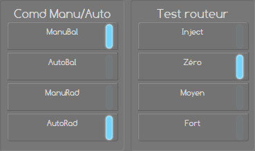

<p align="center"></p>

    
# Les scripts des commandes du MsunPv
</br>

- [Explication du fonctionnement](#explication-du-fonctionnement)
- [Détails du fichier msunpv_script_x_x.yaml](#détails-du-fichier-msunpv_script_x_xyaml)
- [Exemple du fonctionnement en image](#exemple-du-fonctionnement-en-image)
</br>

## Explication du fonctionnement
Pour intéragir avec le MsunPv on peut utiliser des commandes 'curl' par le biais des 'shell_command' de Home Assistant.</br>

Par exemple :
```yml
shell_command:
  msunpv_manurad_on: "curl -X POST -d 'parS=4;0;0;0;0;0;0;2;' http://IP_DU_MSUNPV/index.xml"
```
>'pars=9;0;0;0;0;0;0;2;' contenant la commande à envoyer au routeur.</br>

On pourrait ce dire, ok le 9 correspond à la commande à envoyer sur la sortie 1, le 1er 0 la sortie 2 et ainsi de suite jusqu'a la sortie 8. Cela serait bien trop simple. Les sorties sont liées 2 par 2. Du coup le 9 correspond à la comande envoyée à la sortie 1 et 2, le 1er 0 pour les sorties 3 et 4 et ainsi de suite.

>Je crois qu'il y'a 8 sorties pilotables sur les MsunPv_2_2 et MsunPv_4_4, les 0 supplémentaires au delà du 4ème chiffre, que l'on pourrait imaginer être pour les sorties 9 à 14 sont inutiles dans notre cas. Sans doute un héritage du grand frère du MsunPv.

Voici comment elles sont codées :
| Valeur | Cmd 1 | Cmd 2 | 
| --------- | --- | ---------- | 
| 0 | off | off |
| 1 | manuel | off |
| 2 | auto | off |
| 4 | off | manuel |
| 5 | manuel | manuel |
| 6 | auto | manuel |
| 8 | off | auto |
| 9 | manuel | auto |
| 10 | auto | auto |

On peut répéter ce schéma pour les comandes 3-4, 5-6 et 7-8.</br></br>
Le 2 à la fin 'pars=9;0;0;0;0;0;0;2;' correspond quand à lui à la commande 'Test routeur' du MsunPv. Elle est codée comme ceci:
| Valeur | Cmd 1 | 
| --------- | --- |
| 0 | Inject |
| 1 | Zéro |
| 2 | Moyen |
| 4 | Fort |

Sur notre exemple du dessus avec 'pars=9;0;0;0;0;0;0;2;' cela correspondrait donc à l'image ci-dessous sur le routeur :



Grâce au tableau détaillant comment sont codées les commandes, on peut se rendre compte que pour passer le sortie 1 de OFF à MANUEL (sans toucher à sortie 2), il faut ajouter 1 à la Cmd1. De même pour passer de OFF à AUTO il faur retrancher 2. Pour la sortie 2 il faudra par contre ajouter 4 pour passer de OFF à MANUEL.</br></br>

C'est ce comportement que reproduisent les scripts. Ils analysent l'état de chaque sorties grâce au sensor 'msunpv_cmdpos' remonté par le fichier 'status.xml' du MsunPv et en fonction du l'état que l'on veut atteindre, ils ajoutent ou retranchent 1,2,4,8 à la commande à envoyer au MsunPv. Pour la commande 'Test routeur' du MsunPv on envoi directement la valeur désirée.

</br>

## Détails du fichier msunpv_script_x_x.yaml
J'ai fait le choix pour rester simple de créer 3 scripts par commandes. Un premier script pour faire un reset de la commande, le second pour activer le mode MANUEL et le troisième pour le mode AUTO.</br>

Exemple avec la sortie 1 :
```yml
# Scripts des commandes pour MsunPv en configuration 2_2

script:

  msunpv_s1_off: #Mode routage actif sortie 1
    alias: msunpv_s1_off
    sequence:
      - service: input_select.select_option
        data:
          option: |-
            
              {{ states('sensor.msunpv_cmd_s1')|int -1 }}
            
              {{ states('sensor.msunpv_cmd_s1')|int -2 }}
            
              {{ states('sensor.msunpv_cmd_s1')|int }}
            
        target:
          entity_id: input_select.msunpv_command_sortie_1
      - service: input_select.select_option
        data:
          option: "{{ states('sensor.msunpv_cmd_test') }}"
        target:
          entity_id: input_select.msunpv_command_test_routeur
      - service: script.msunpv_commande_routeur
        data: {}
    mode: single
    
  msunpv_s1_manuel: #Mode forçage sortie 1
    alias: msunpv_s1_manuel
    sequence:
      - service: input_select.select_option
        data:
          option: |-
            
              {{ states('sensor.msunpv_cmd_s1')|int +1 }}
            
              {{ states('sensor.msunpv_cmd_s1')|int -1 }}
            
              {{ states('sensor.msunpv_cmd_s1')|int -1 }}
            
        target:
          entity_id: input_select.msunpv_command_sortie_1
      - service: input_select.select_option
        data:
          option: "{{ states('sensor.msunpv_cmd_test') }}"
        target:
          entity_id: input_select.msunpv_command_test_routeur
      - service: script.msunpv_commande_routeur
        data: {}
    mode: single
    
  msunpv_s1_auto: #Mode programmation horaire sortie 1
    alias: msunpv_s1_auto
    sequence:
      - service: input_select.select_option
        data:
          option: |-
            
              {{ states('sensor.msunpv_cmd_s1')|int +1 }}
            
              {{ states('sensor.msunpv_cmd_s1')|int +2 }}
            
              {{ states('sensor.msunpv_cmd_s1')|int -2 }}
            
        target:
          entity_id: input_select.msunpv_command_sortie_1
      - service: input_select.select_option
        data:
          option: "{{ states('sensor.msunpv_cmd_test') }}"
        target:
          entity_id: input_select.msunpv_command_test_routeur
      - service: script.msunpv_commande_routeur
        data: {}
    mode: single
```
- Pour chacun des scripts on retrouve 3 parties :
```yml
      - service: input_select.select_option
        data:
          option: |-
            
              {{ states('sensor.msunpv_cmd_s1')|int -1 }}
            
              {{ states('sensor.msunpv_cmd_s1')|int -2 }}
            
              {{ states('sensor.msunpv_cmd_s1')|int }}
            
        target:
          entity_id: input_select.msunpv_command_sortie_1
```
La 1ère vérifie l'état actuel des sorties 1 et 2 et choisi la valeur à envoyer en fonction de l'état désiré par le biais d'un 'input_select'.
>'input_select.msunpv_command_sortie_1' est défini dans le fichier 'msunpv_x_x.yaml'

</br>

```yml
      - service: input_select.select_option
        data:
          option: "{{ states('sensor.msunpv_cmd_test') }}"
        target:
          entity_id: input_select.msunpv_command_test_routeur
```
La 2ème récupère l'état de la sortie 'Test routeur' et renvoie sa valeur par le biais d'un 'input_select' également.
>'input_select.msunpv_command_test_routeur' est défini dans le fichier 'msunpv_x_x.yaml'

</br>

```yml
      - service: script.msunpv_commande_routeur
        data: {}
```
La 3ème appelle le script 'msunpv_commande_routeur' qui permet d'envoyer les commandes au routeur.</br>

>Sur la version _4_4 il y'a une partie supplémentaire qui se charge de récupérer l'état des sorties 3 et 4 également.
>```yml
>      - service: input_select.select_option
>        data:
>          option: "{{ states('sensor.msunpv_cmd_s3') }}"
>        target:
>          entity_id: input_select.msunpv_command__sortie_3
>```

</br>

- Le script 'msunpv_routage_on_off':
```yml
  msunpv_routage_on_off: #Bascule entre routage et injection
    alias: msunpv_routage_on_off
    sequence:
      - service: input_select.select_option
        data:
          option: |-
            
              2
            
              1
            
        target:
          entity_id: input_select.msunpv_command_test_routeur
      - service: input_select.select_option
        data:
          option: "{{ states('sensor.msunpv_cmd_s1') }}"
        target:
          entity_id: input_select.msunpv_command_sortie_1
      - service: script.msunpv_commande_routeur
        data: {}
    mode: single
```
Fait la même chose que les précédents mais pour la sortie 'Test routeur'.</br></br>

- Le script 'msunpv_commande_routeur' :
```yml
  msunpv_commandes_routeur: #Envoi des commandes au MsunPv
    alias: msunpv_commande_routeur
    sequence:
      - service: shell_command.msunpv_commandes
        data: {}
      - delay:
          hours: 0
          minutes: 0
          seconds: 1
          milliseconds: 0
      - service: homeassistant.update_entity
        data: {}
        target:
          entity_id: sensor.msunpv_xml
    mode: single
```
Ce dernier script appelle la 'shell_command' qui va piloter le MsunPv, puis fait une pause et force un update du sensor 'msunpv_xml' pour faire remonter les nouveau états dans l'interface de Home Assistant plus rapidement.
>La 'shell_command.msunpv_commandes' est défini dans le fichier 'msunpv_x_x.yaml'
>```yml
>shell_command:
>   msunpv_commandes: "curl -X POST -d 'parS={{ states('input_select.msunpv_command_sortie_1') }};0;0;0;0;0;0;{{ states('input_select.msunpv_command_test_routeur') }};' http://IP_DU_MSUNPV/index.xml"
>```

</br></br>

## Exemple du fonctionnement en image
</br></br></br>
