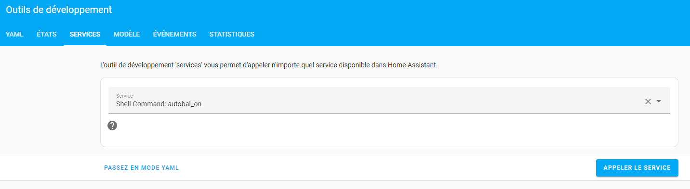

# MsunPv to HA
</br>

- [Introduction](#introduction)
- [Fonctionnalités](#-fonctionnalités)
- [Installation](#%EF%B8%8F-installation)
- [comment-ça-fonctionne-?](#-comment-%C3%A7a-fonctionne-)
- [FAQ](#faq)
</br>

## Introduction
Une intégration par le biais d'un fichier .yaml pour faire communiquer le routeur solaire MsunPv de [Ard-tek](https://ard-tek.com/) et Home Assistant.</br>
Précision préalable, le code de ce fichier est pour une version 2 entrées, 2 sorties du MsunPv avec PowPV en négatif et les compteurs EnConso, EnInj, EnPV_J, EnPV_P en négatifs également (Projet MS_PV2_2b). Tout cela est bien sur facilement adaptable pour un MsunPv 4 entrées, 4 sorties ou des valeurs positives.</br></br></br>

## 🧐 Fonctionnalités
- Récupére les infos fournies par le MsunPv (Puissances, % de routage, températures, tension)
- Récupére les valeurs des compteurs interne du MsunPv
- Permet d'intégrer les compteurs de consomation, de production et d'injection du MsunPv au 'dashboard energie' de Home Assistant
- Permet d'envoyer des ordre au MsunPv (ex. activer manubal pour forcer la chauffe du cumulus)
</br>

## 🛠️ Installation
- Télécharger le fichier 'msunpv.yaml'.
- Créer un dossier nommé 'packages' a la racine du dossier 'config' de Home Assistant.
- Copier le fichier téléchargé 'msunpv.yaml' dans le dossier 'packages'.
- Ouvrir le fichier 'msunpv.yaml' et remplacer dans celui-ci 'IP_DU_MSUNPV' par l'adresse ip de votre MsunPv **partout où cela est nécessaire dans le fichier** puis sauvegarder.

    ```yml
    - resource: http://IP_DU_MSUNPV/status.xml
    ```
    Devient, si l'adresse ip de votre MsunPv est '192.168.0.111'
    ```yml
    - resource: http://192.168.0.111/status.xml
- Ajouter dans le fichier 'configuration.yaml' de Home Assistant les lignes suivantes

    ```yml
    homeassistant:
      packages: !include_dir_named packages
    ```

    Si la ligne 'homeassistant:' n'existe pas déja sinon ajouter simplement

    ```yml
      packages: !include_dir_named packages
    ```

    En dessous de celles-ci pour obtenir (par ex.)

    ```yml
    homeassistant:
      customize: !include customize.yaml
      packages: !include_dir_named packages
    ```

- Sauvegarder et redémarrer complétement Home Assistant.
- Après le redémarrage vous devriez voir apparaitre de nouveaux sensors dans Home Assistant

    
</br></br></br>


## 🧑🏻‍💻 Comment ça fonctionne ?
Le but est de récupérer les infos fournit par le MsunPv à l'adresse http://IP_DU_MSUNPV/status.xml
```xml
<xml>
    <rtcc>20:05:56 DI</rtcc>
    <paramSys>20:05:57;22/10/2023;On;01:00;0,0;MS_PV2_2b;5.0.1;0000220;104a;104a;00:00;00:00</paramSys>
    <inAns>326,4;75,5; 0; 0;233,3;0,0;0,0;0,0; 0; 0; 0; 0; 0; 0; 0; 0;</inAns>
    <survMm>0;0;0;0;0;0;0;0;0;0;0;0;0;0;0;0;</survMm>
    <cmdPos>0;0;0;0;0;0;0;2;</cmdPos>
    <outStat>0;0;0;0;0;0;0;0;0;0;0;0;0;0;0;0;</outStat>
    <cptVals>7e5c;ffffc2f3;fffea838;fdd3ef99;0;0;0;0;</cptVals>
    <chOutVal>0;0;0;ff;:0,0;0,0;0,0;0,0;</chOutVal>
</xml>
```
Les infos qui nous interressent sont les dans lignes 'inAns', 'cmdPos' et 'chOutVal' et à partir de celles-ci on crée des sensors Home Assistant afin de pouvoir soit les afficher soit les exploiter dans des automatisations ou scripts.

La partie du code permettant de les récupérer est la suivante :

```yml
rest:
  #Récupération des données
  - resource: http://IP_DU_MSUNPV/status.xml
    scan_interval: 20 #Temps de récupération des données ici fixé à 20 secondes
    method: GET
    sensor:
      - name: "msunpv_xml"
        json_attributes_path: "$.xml"
        value_template: "OK"
        json_attributes:
          - "inAns"
          - "cmdPos"
          - "cptVals"
```
La ligne :

```yml
    scan_interval: 20 #Temps de récupération des données ici fixé à 20 secondes
```

Permet de faire cette récupération toutes les 20 secondes. Vous pouvez la modifier pour récupérer plus ou moins souvent les infos.</br></br>

Une fois les infos récupérées on les traite pour créer les différents sensors

```yml
template:
  - sensor:
      #Les entrées
      - name: msunpv_powreso #Puissance réseau
        unique_id: "msunpv_powreso"
        state: >-
          {{ (state_attr('sensor.msunpv_xml', 'inAns')|replace(" ","")|replace(",",".")).split(";")[0] |float }}
        device_class: power
        unit_of_measurement: "W"

      - name: msunpv_powpv #Puissance panneaux
        unique_id: "msunpv_powpv"
        state: >-
          {{ (state_attr('sensor.msunpv_xml', 'inAns')|replace(" ","")|replace(",",".")).split(";")[1] |float }}
        device_class: power
        unit_of_measurement: "W"

      - name: msunpv_outbal #% routage cumulus
        unique_id: "msunpv_outbal"
        state: >-
          {{ (state_attr('sensor.msunpv_xml', 'inAns')|replace(" ","")|replace(",",".")).split(";")[2] |int }}
        unit_of_measurement: "%"

etc...
```
Si par exemple vous n'avez pas de sonde de température branchée sur le MsunPv vous pouvez commenter les lignes les concernant comme ceci :

```yml
      - name: msunpv_voltres #Tension réseau
        unique_id: "msunpv_voltres"
        state: >-
          {{ (state_attr('sensor.msunpv_xml', 'inAns')|replace(" ","")|replace(",",".")).split(";")[4] |float }}
        unit_of_measurement: "V"

#      - name: msunpv_t_bal1 #Température cumulus
#        unique_id: "msunpv_t_bal1"
#        state: >-
#          {{ (state_attr('sensor.msunpv_xml', 'inAns')|replace(" ","")|replace(",",".")).split(";")[5] |float }}
#        unit_of_measurement: "°C"
#
#      - name: msunpv_t_sdb #Température salle de bain
#        unique_id: "msunpv_t_sdb"
#        state: >-
#          {{ (state_attr('sensor.msunpv_xml', 'inAns')|replace(" ","")|replace(",",".")).split(";")[6] |float }}
#        unit_of_measurement: "°C"
#
#      - name: msunpv_t_amb #Température ambiante
#        unique_id: "msunpv_t_amb"
#        state: >-
#          {{ (state_attr('sensor.msunpv_xml', 'inAns')|replace(" ","")|replace(",",".")).split(";")[7] |float }}
#        unit_of_measurement: "°C"
```
Vous pouvez bien sur faire de même pour tous les capteurs qui ne vous interressent pas.

On peut voir dans le code que les sensors sont regroupés en 3 parties.

- Les 'entrées' qui concernent les différentes sondes branchées sur le MsunPv
- Les 'compteurs' qui remontent les valeurs des compteurs internes du MsunPv
- Les 'commandes' qui permettent d'envoyer des ordres au MsunPv</br></br>

A partir de là on peut créer des cartes dans Home Assistant pour afficher les valeurs que l'on souhaite :</br></br>

Intégrer les compteurs dans le dashboard energy de Home Assistant :</br></br>

Envoyer des ordres au routeur à l'aide des services :</br></br>

Ou encore Par le biais d'automatisations :</br></br>

</br></br>
## FAQ
- Voir le fichier FAQ
</br></br></br>
