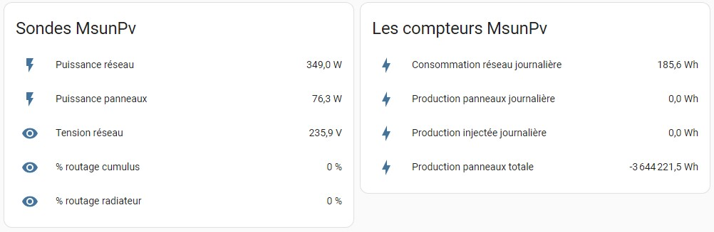
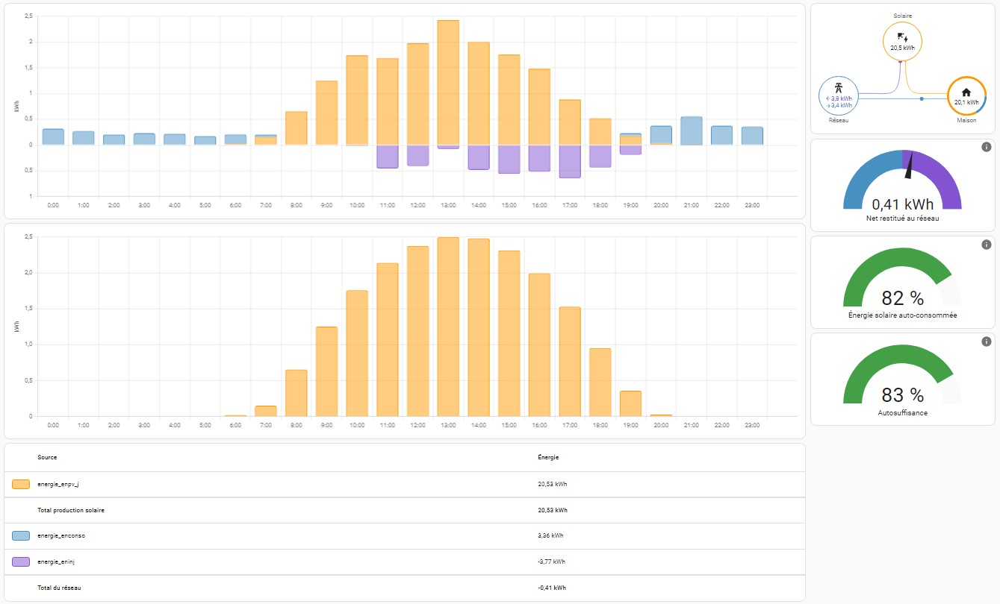
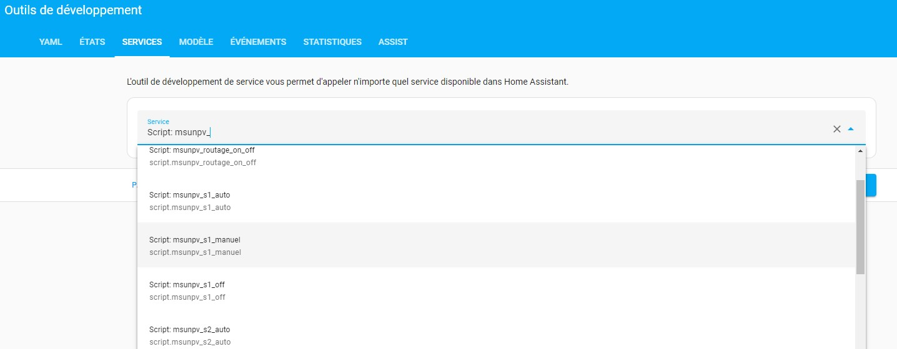
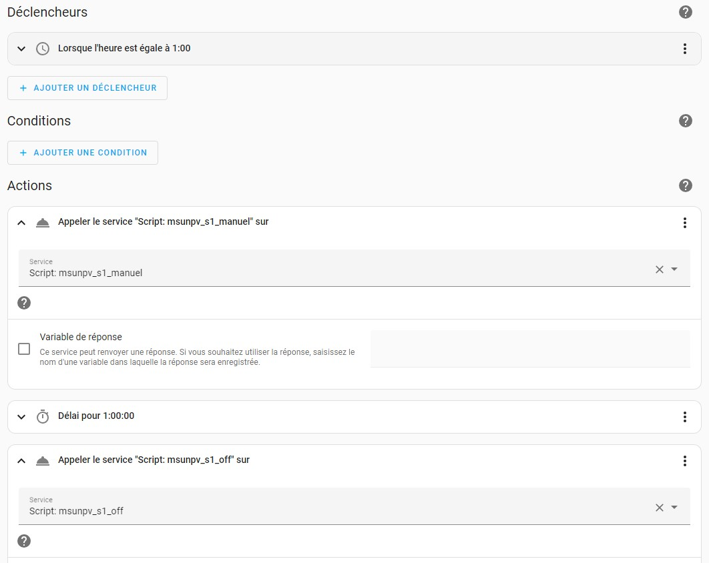
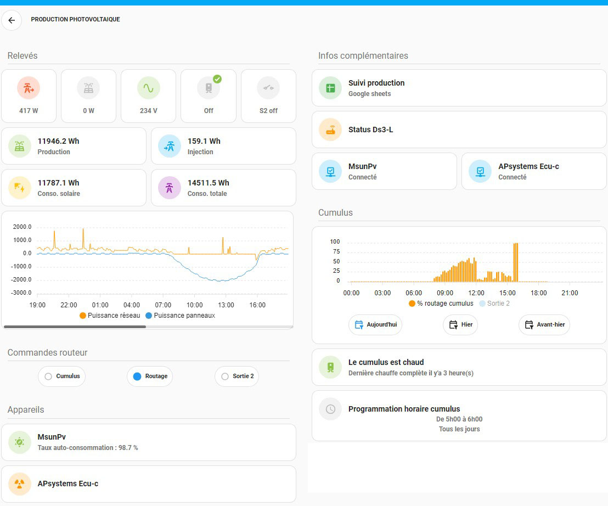

<p align="center"></p>
    
# MsunPv to HA
</br>

- [Introduction](#introduction)
- [Fonctionnalités](#-fonctionnalités)
- [Installation](#%EF%B8%8F-installation)
- [Comment ça fonctionne ?](#-comment-%C3%A7a-fonctionne-)
- [Exemple du résultat dans mon dashboard Home Assistant](#exemple-du-r%C3%A9sultat-dans-mon-dashboard-home-assistant)
- [Mises à jour](https://github.com/tochy83/MsunPv_to_HA/edit/main/README.md#mises-%C3%A0-jour)
- [FAQ](#faq)
</br>

## Introduction
Une intégration par le biais d'un fichier .yaml pour faire communiquer le routeur solaire MsunPv de [Ard-tek](https://ard-tek.com/) et Home Assistant.</br></br>
Précision préalable, le code de ce fichier a été écrit à la base pour une version 2 entrées, 2 sorties du MsunPv avec PowPV en négatif et les compteurs EnConso, EnInj, EnPV_J, EnPV_P en négatifs également (Projet MS_PV2_2b). Je l'ai décliné (par déduction) en une version 4 entrées, 4 sorties avec les compteurs en négatifs également (Projet MS_PV4_4b). Tout cela est bien sur facilement adaptable si vous êtes sur une configuration différente sur votre MsunPv (ex. [compteurs en positifs](/FAQ.md#cest-bien-beau-ton-truc-mais-mes-compteurs-sont-en-positifs-comment-je-fais-)).</br></br></br>

## 🧐 Fonctionnalités
- Récupére les infos fournies par le MsunPv (Puissances, % de routage, températures, tension ...)
- Récupére les valeurs des compteurs interne du MsunPv
- Permet d'intégrer les compteurs de consommation, de production et d'injection du MsunPv au 'dashboard energie' de Home Assistant
- Permet d'envoyer des ordres au MsunPv (ex. activer manubal pour forcer la chauffe du cumulus)
</br>

## 🛠️ Installation
- Télécharger les fichiers 'msunpv_2_2.yaml' et 'msunpv_scripts_2_2.yaml' ou les fichiers 'msunpv_4_4.yaml' et 'msunpv_scripts_4_4.yaml' selon que vous disposez d'une version 2 sorties ou 4 sorties et selon vos besoins.
    >- Le fichier 'msunpv_x_x.yaml' récupère toutes les infos nécessaires au fonctionnement et crée les sensors pour Home Assistant.</br></br>
    >- Le fichier 'msunpv_scripts_x_x.yaml' contient tous les scripts pour commander le MsunPv depuis Home Assistant. Sans ce fichier pas de pilotage du MsunPv depuis Home Assistant (Il est inutile si vous ne souhaitez pas le faire). [Détails et explications ici.](/COMMANDES.md#les-scripts-des-commandes-du-msunpv)</br></br>
    >- Un fichier 'msunpv_addons_progh_x_x.yaml' est disponible et contient les sensors permettant de visualiser les programmations horaires du MsunPv depuis Home Assistant (Il est inutile si vous ne souhaitez pas les afficher).</br></br>
    >- Un fichier 'msunpv_addons_moresensors.yaml' est disponible et contient des sensors supplémentaires. Consommtion totale, production consommée, taux d'auto-consommation, taux d'auto-suffisance et des infos sur le MsunPv. (Il est inutile si vous ne souhaitez pas les afficher).
- Ajouter dans le fichier 'configuration.yaml' de Home Assistant les lignes suivantes

    ```yml
    homeassistant:
      packages: !include_dir_named packages
    ```

    Si la ligne 'homeassistant:' n'existe pas déja sinon ajouter simplement

    ```yml
      packages: !include_dir_named packages
    ```

    En dessous de celles-ci pour obtenir (par ex.)

    ```yml
    homeassistant:
      customize: !include customize.yaml
      packages: !include_dir_named packages
    ```

- Créer un dossier nommé 'packages' à la racine du dossier 'config' de Home Assistant.
- Créer dans le dossier nommé 'packages' que vous venez de créer un dossier nommé 'msunpv'.
- Copier les fichiers téléchargés 'msunpv_x_x.yaml' et 'msunpv_scripts_x_x.yaml' dans le dossier 'msunpv' créé précédemment.
    >La création du dossier 'msunpv' n'est pas obligatoire et on pourrait très bien mettre les fichiers directement dans le dossier 'packages'. C'est juste une question d'organisation pour que tous les fichiers concernant le MsunPv se retrouvent tous au même endroit, ce qui me parait plus simple pour les retrouver.
- Ouvrir le fichier 'msunpv_x_x.yaml' et remplacer dans celui-ci 'IP_DU_MSUNPV' par l'adresse ip de votre MsunPv **partout où cela est nécessaire dans le fichier** puis sauvegarder.

    ```yml
    - resource: http://IP_DU_MSUNPV/status.xml
    ```
    Devient, si l'adresse ip de votre MsunPv est '192.168.0.111'
    ```yml
    - resource: http://192.168.0.111/status.xml
    ```
- Sauvegarder et redémarrer complétement Home Assistant.
- Après le redémarrage vous devriez voir apparaitre de nouveaux sensors dans Home Assistant

    </br></br>

    >Une vidéo youtube montant toute la manip est dispo: [Comment installer msunpv.yaml](https://youtu.be/zj8lhvfRkjQ).

</br>

- A partir de là on peut :

    </br>
    - Créer des cartes dans Home Assistant pour afficher les valeurs que l'on souhaite :</br>
    
    
  
    >[Tous les sensors remontés par l'intégration.](/SENSORS%20AND%20SCRIPTS.md#aper%C3%A7u-des-sensors-et-scripts-remont%C3%A9s-par-lint%C3%A9gration)

    </br>
    - Intégrer les compteurs dans le dashboard energy de Home Assistant :</br></br>
    
    
    
    </br>
    - Envoyer des ordres au routeur à l'aide des services :</br></br>
    
    
    
    </br>
    - Ou encore Par le biais d'automatisations :</br></br>
    
    

    >Une page est dédiée à l'explication du fonctionnement des [commandes.](/COMMANDES.md#les-scripts-des-commandes-du-msunpv)
  
</br></br></br>


## 🧑🏻‍💻 Comment ça fonctionne ?
Le but est de récupérer les infos fournit par le MsunPv à l'adresse http://IP_DU_MSUNPV/status.xml
```xml
<xml>
    <rtcc>20:05:56 DI</rtcc>
    <paramSys>20:05:57;22/10/2023;On;01:00;0,0;MS_PV2_2b;5.0.1;0000220;104a;104a;00:00;00:00</paramSys>
    <inAns>326,4;75,5; 0; 0;233,3;0,0;0,0;0,0; 0; 0; 0; 0; 0; 0; 0; 0;</inAns>
    <survMm>0;0;0;0;0;0;0;0;0;0;0;0;0;0;0;0;</survMm>
    <cmdPos>0;0;0;0;0;0;0;2;</cmdPos>
    <outStat>0;0;0;0;0;0;0;0;0;0;0;0;0;0;0;0;</outStat>
    <cptVals>7e5c;ffffc2f3;fffea838;fdd3ef99;0;0;0;0;</cptVals>
    <chOutVal>0;0;0;ff;:0,0;0,0;0,0;0,0;</chOutVal>
</xml>
```
Les infos qui nous interressent sont les dans lignes 'inAns', 'cmdPos' et 'cptVals' et à partir de celles-ci on crée des sensors Home Assistant afin de pouvoir soit les afficher soit les exploiter dans des automatisations ou scripts.

La partie du code permettant de les récupérer est la suivante :

```yml
rest:
  #Récupération des données
  - resource: http://IP_DU_MSUNPV/status.xml
    scan_interval: 30 #Temps de récupération des données ici fixé à 30 secondes
    method: GET
    sensor:
      - name: "msunpv_xml"
        json_attributes_path: "$.xml"
        value_template: "OK"
        json_attributes:
          - "inAns"
          - "cmdPos"
          - "cptVals"
```
La ligne :

```yml
    scan_interval: 30 #Temps de récupération des données ici fixé à 30 secondes
```

Permet de faire cette récupération toutes les 30 secondes. Vous pouvez la modifier pour récupérer plus ou moins souvent les infos.</br></br>

Une fois les infos récupérées on les traite pour créer les différents sensors.

```yml
template:
  - sensor:
      #Les entrées
      - name: msunpv_powreso #Puissance réseau
        unique_id: "msunpv_powreso"
        state: >-
          {{ (state_attr('sensor.msunpv_xml', 'inAns')|replace(" ","")|replace(",",".")).split(";")[0] |float }}
        device_class: power
        unit_of_measurement: "W"

      - name: msunpv_powpv #Puissance panneaux
        unique_id: "msunpv_powpv"
        state: >-
          {{ (state_attr('sensor.msunpv_xml', 'inAns')|replace(" ","")|replace(",",".")).split(";")[1] |float }}
        device_class: power
        unit_of_measurement: "W"

      - name: msunpv_outbal #% routage cumulus
        unique_id: "msunpv_outbal"
        state: >-
          {{ (state_attr('sensor.msunpv_xml', 'inAns')|replace(" ","")|replace(",",".")).split(";")[2] |int }}
        unit_of_measurement: "%"

etc...
```
Si par exemple vous n'avez pas de sonde de température branchée sur le MsunPv vous pouvez commenter les lignes les concernant comme ceci :

```yml
      - name: msunpv_voltres #Tension réseau
        unique_id: "msunpv_voltres"
        state: >-
          {{ (state_attr('sensor.msunpv_xml', 'inAns')|replace(" ","")|replace(",",".")).split(";")[4] |float }}
        unit_of_measurement: "V"

#      - name: msunpv_t_bal1 #Température cumulus
#        unique_id: "msunpv_t_bal1"
#        state: >-
#          {{ (state_attr('sensor.msunpv_xml', 'inAns')|replace(" ","")|replace(",",".")).split(";")[5] |float }}
#        unit_of_measurement: "°C"
#
#      - name: msunpv_t_sdb #Température salle de bain
#        unique_id: "msunpv_t_sdb"
#        state: >-
#          {{ (state_attr('sensor.msunpv_xml', 'inAns')|replace(" ","")|replace(",",".")).split(";")[6] |float }}
#        unit_of_measurement: "°C"
#
#      - name: msunpv_t_amb #Température ambiante
#        unique_id: "msunpv_t_amb"
#        state: >-
#          {{ (state_attr('sensor.msunpv_xml', 'inAns')|replace(" ","")|replace(",",".")).split(";")[7] |float }}
#        unit_of_measurement: "°C"
```
Vous pouvez bien sur faire de même pour tous les capteurs qui ne vous interressent pas. Je vous encourage d'ailleurs à le faire car il n'y a rien de plus chiant que de devoir parcourir toute une liste de sensors inutiles quand on en cherche un en particulier.

</br></br>Pour faciliter la lecture du code (fichier 'msunpv_x_x.yaml') j'ai regroupé les sensors en 3 catégories :

- Les 'entrées' qui concernent les différentes sondes branchées sur le MsunPv.
- Les 'compteurs' qui remontent les valeurs des compteurs internes du MsunPv.
- Les 'commandes' qui permettent d'envoyer des ordres au MsunPv.</br></br>


## Exemple du résultat dans mon dashboard Home Assistant



</br></br>

## Mises à jour
Seule la dernière entrée apparait ici. Consulter [la liste complète](/CHANGELOG.md).

#### 2024-10-04 - Bug Fixes
* Correction d'une petite coquille qui empêchait les sauvegardes des fichiers CSV de septembre dans le fichier 'msunpv_save_sd_csv.yaml'. ([637a0e3](https://github.com/tochy83/MsunPv_to_HA/commit/637a0e3953eb1c184afbf797d3ab185edb5dead8))
  ```yml
  La ligne :
    
  
  Devient :
    
  ```
</br></br>
## FAQ
- Accédez à la [FAQ](/FAQ.md#faq)
- [Comment installer msunpv.yaml](https://youtu.be/zj8lhvfRkjQ) Une vidéo qui montre comment installer l'intégration en moins de 5 minutes (lien Youtube).
- [Détails du fonctionnement des scripts pour piloter le MsunPv.](/COMMANDES.md#les-scripts-des-commandes-du-msunpv)
- [C'est bien beau ton truc mais mes compteurs sont en positifs, comment je fais ?](/FAQ.md#cest-bien-beau-ton-truc-mais-mes-compteurs-sont-en-positifs-comment-je-fais-)
- [J'ai une sonde qui mesure la puissance du cumulus, comment je fais ?](/FAQ.md#jai-une-sonde-qui-mesure-la-puissance-du-cumulus-comment-je-fais-)
- [Et si je veux faire apparaitre un capteur autre que ceux déjà présent, comment je fais ?](/FAQ.md#et-si-je-veux-faire-apparaitre-un-capteur-autre-que-ceux-d%C3%A9j%C3%A0-pr%C3%A9sent-comment-je-fais-)
- [Renommer les sensors.](/SENSORS%20AND%20SCRIPTS.md#renommer-les-sensors)
- [Je n'ai plus de MsunPv ou je souhaite repartir de zéro, comment je fais ?](/FAQ.md#je-nai-plus-de-msunpv-ou-je-souhaite-repartir-de-z%C3%A9ro-comment-je-fais-)
- [Commenter, décommenter rapidement des sections de code avec File éditor.](/FAQ.md#commenter-d%C3%A9commenter-rapidement-des-sections-de-code-avec-file-%C3%A9ditor)

</br></br></br>J'ai essayé de faire le plus complet possible, mais il se peut qu'il manque des infos. N'hésitez pas à poser vos questions [sur la page dédiée dans le forum ArdTek](https://ard-tek.com/index.php/forum/vos-installations-mspv/1127-tuto-home-assistant-et-msunpv) ou sur la [page dédiée du forum HACF](https://forum.hacf.fr/t/routeur-solaire-msunpv-et-ha/30312).

</br></br></br>
