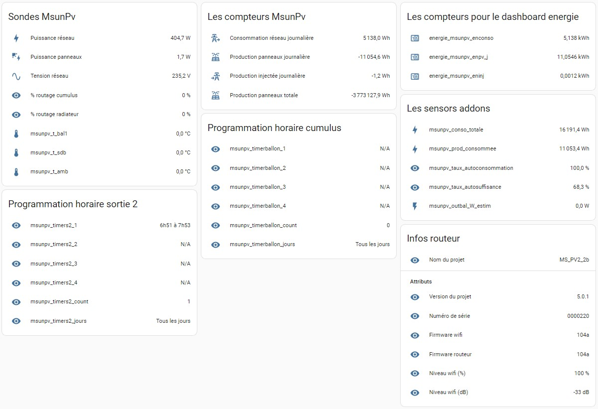

<p align="center"></p>


# Aperçu des sensors et scripts remontés par l'intégration
</br>

- [Tous les sensors de l'intégration MsunPv](#tous-les-sensors-de-lint%C3%A9gration-msunpv)
- [Tous les scripts de l'intégration MsunPv.](#tous-les-scripts-de-lint%C3%A9gration-msunpv)
- [Renommer les sensors.](/SENSORS%20AND%20SCRIPTS.md#renommer-les-sensors)
</br>
   
## Tous les sensors de l'intégration MsunPv.



>Tous ces sensors sont remontés dans Home Assistant par l'integration en version 2 entrées, 2 sorties. La version 4 entrées, 4 sorties aura en plus des sensors pour la 'Programmation horaire sortie 3' et pour la 'Programmation horaire sortie 4'.

<details>
  <summary>Le code de la carte 'Sondes MsunPv' : (Cliquer pour dérouler)</summary>

```yml
type: entities
entities:
  - entity: sensor.msunpv_powreso
  - entity: sensor.msunpv_powpv
  - entity: sensor.msunpv_voltres
  - entity: sensor.msunpv_outbal
  - entity: sensor.msunpv_outrad
  - entity: sensor.msunpv_t_bal1
  - entity: sensor.msunpv_t_sdb
  - entity: sensor.msunpv_t_amb
title: Sondes MsunPv
```
</details>
<details>
  <summary>Le code de la carte 'les compteurs MsunPv' : (Cliquer pour dérouler)</summary>

```yml
type: entities
entities:
  - entity: sensor.msunpv_enconso
  - entity: sensor.msunpv_enpv_j
  - entity: sensor.msunpv_eninj
  - entity: sensor.msunpv_enpv_p
title: Les compteurs MsunPv
```
</details>
<details>
  <summary>Le code de la carte 'Les sensors addons' : (Cliquer pour dérouler)</summary>

```yml
type: entities
entities:
  - entity: sensor.msunpv_conso_totale
  - entity: sensor.msunpv_prod_consommee
  - entity: sensor.msunpv_taux_autoconsommation
  - entity: sensor.msunpv_taux_autosuffisance
title: Les sensors addons
```
</details>
<details>
  <summary>Le code de la carte 'Programmation horaire cumulus' : (Cliquer pour dérouler)</summary>

```yml
type: entities
entities:
  - entity: sensor.msunpv_timerballon_1
  - entity: sensor.msunpv_timerballon_2
  - entity: sensor.msunpv_timerballon_3
  - entity: sensor.msunpv_timerballon_4
  - entity: sensor.msunpv_timerballon_count
  - entity: sensor.msunpv_timerballon_jours
title: Programmation horaire cumulus
```
</details>
<details>
  <summary>Le code de la carte 'Programmation horaire sortie 2' : (Cliquer pour dérouler)</summary>

```yml
type: entities
entities:
  - entity: sensor.msunpv_timers2_1
  - entity: sensor.msunpv_timers2_2
  - entity: sensor.msunpv_timers2_3
  - entity: sensor.msunpv_timers2_4
  - entity: sensor.msunpv_timers2_count
  - entity: sensor.msunpv_timers2_jours
title: Programmation horaire sortie 2
```
</details>
<details>
  <summary>Le code de la carte 'Infos routeur' : (Cliquer pour dérouler)</summary>

```yml
type: entities
entities:
  - entity: sensor.msunpv_infos
    name: Nom du projet
  - type: section
    label: Attributs
  - type: attribute
    entity: sensor.msunpv_infos
    name: Version du projet
    attribute: version
  - type: attribute
    entity: sensor.msunpv_infos
    name: Numéro de série
    attribute: num_de_serie
  - type: attribute
    entity: sensor.msunpv_infos
    name: Firmware wifi
    attribute: firmware_wifi
  - type: attribute
    entity: sensor.msunpv_infos
    name: Firmware routeur
    attribute: firmware_routeur
  - type: attribute
    entity: sensor.msunpv_infos
    name: Niveau wifi (%)
    attribute: rssi_percent
    suffix: '%'
  - type: attribute
    entity: sensor.msunpv_infos
    name: Niveau wifi (dB)
    attribute: rssi_db
    suffix: dB
title: Infos routeur
```
</details>

</br>
Concernant les sensors programation horaire, ils ne sont là que pour l'affichage des diverses programmations faites sur le MsunPv et ne servent pas à faire les programmations horaires du MsunPv depuis Home Assitant.
</br></br>


</br></br>

## Tous les scripts de l'intégration MsunPv.


>Tous ces scripts sont pour l'integration en version 2 entrées, 2 sorties. La version 4 entrées, 4 sorties aura en plus des scripts pour la 'sortie 3' et pour la 'sortie 4'.

Je vous recommande pour l'utlisation des scripts, de passer des boutons pour les appeler [comme expliqué ici](COMMANDES.md#exemple-du-fonctionnement-en-image).</br>
Ils peuvent également être appelés dans des automatisations ou dans d'autres scripts.

</br></br>
## Renommer les sensors.

Pour changer les noms des sensors, je vous déconseille de le faire directement dans les divers fichiers '.yaml' car certains sensors servent dans différents fichiers. De plus en cas de mise à jour des fichiers il faudra tout recommencer. Si vous le faites tout de même je vous conseille de bien commenter vos changement dans les fichiers.</br></br>
Utiliser plutot l'UI de Home Assistant pour faire ces changements :


</br></br>

[Retour au README.md](README.md#msunpv-to-ha)

</br></br>
