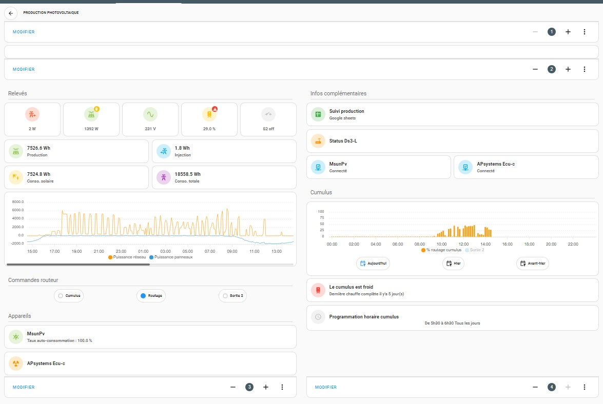
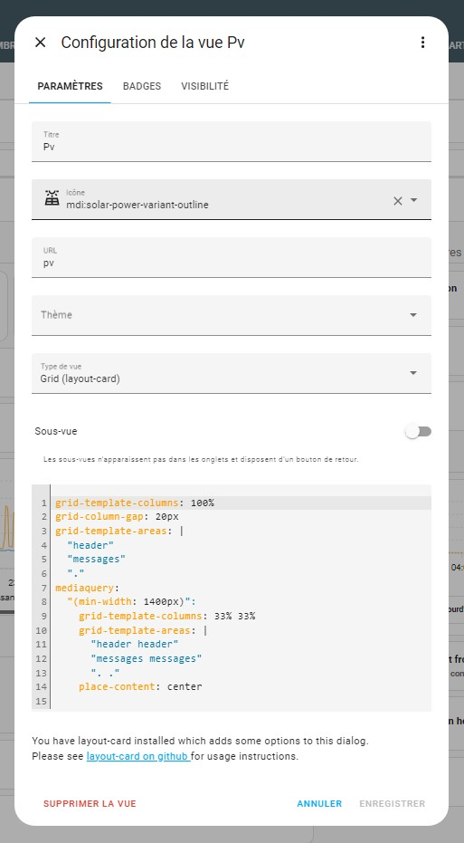
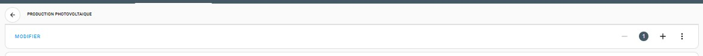
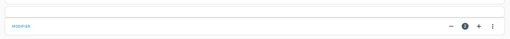
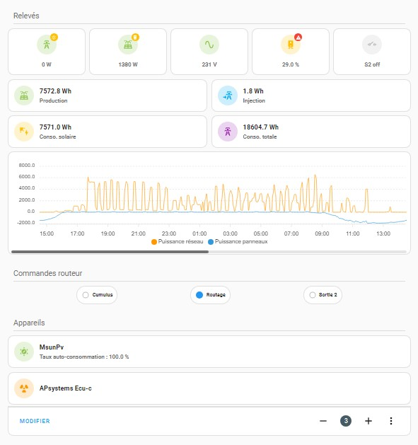
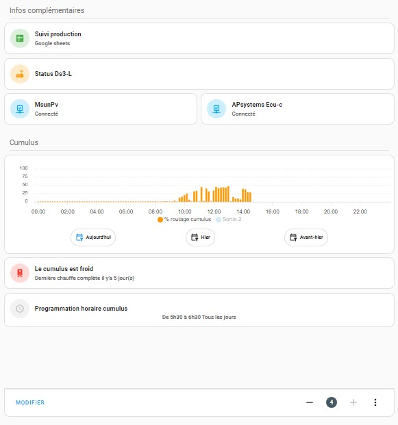

Voici le code de mon dashboard pour la partie photovolatique/MsunPv  
Pour réaliser le même design vous aurez besoin de plusieurs dépots HACS et de 3 scripts pour le fonctionnement des boutons de commande du routeur: 

Depot HACS utilisés pour la page Production photovoltaique 
https://github.com/iantrich/config-template-card 
https://github.com/piitaya/lovelace-mushroom 
https://github.com/thomasloven/lovelace-card-mod 
https://github.com/thomasloven/lovelace-layout-card 
https://github.com/RomRider/apexcharts-card 
https://github.com/custom-cards/stack-in-card 
https://github.com/bramkragten/swipe-card  

Les scripts 
[script.msunpv_bouton_cumulus](script.msunpv_bouton_cumulus.yaml) 
[script.msunpv_bouton_s2](script.msunpv_bouton_s2.yaml) 
[script.msunpv_bouton_routage](script.msunpv_bouton_routage.yaml)  

Vue générale de la page :  
  
La page est découpée en 4 blocs :
- L'entête (bloc 1)
- Une zone de notification (bloc 2)
- Une premier bloc vertical reprenant les infos de production (bloc 3)
- Un second bloc vertical reprenant le reste des infos (bloc 4)  

Pour arriver à ce résultat il convient dans un prmier temps de configurer la vue :  
 
[Le code de la vue](vue_pv.yaml)   
L'entête :  
 
[Le code de l'entête](bloc_1.yaml)   
La zone de notification :  
 
[Le code de la zone notification](bloc_2.yaml)   
Le bloc vertical gauche :  
 
[Le code du bloc gauche](bloc_3.yaml)   
Le bloc vertival droite:  
 
[Le code du bloc droite](bloc_4.yaml)   

